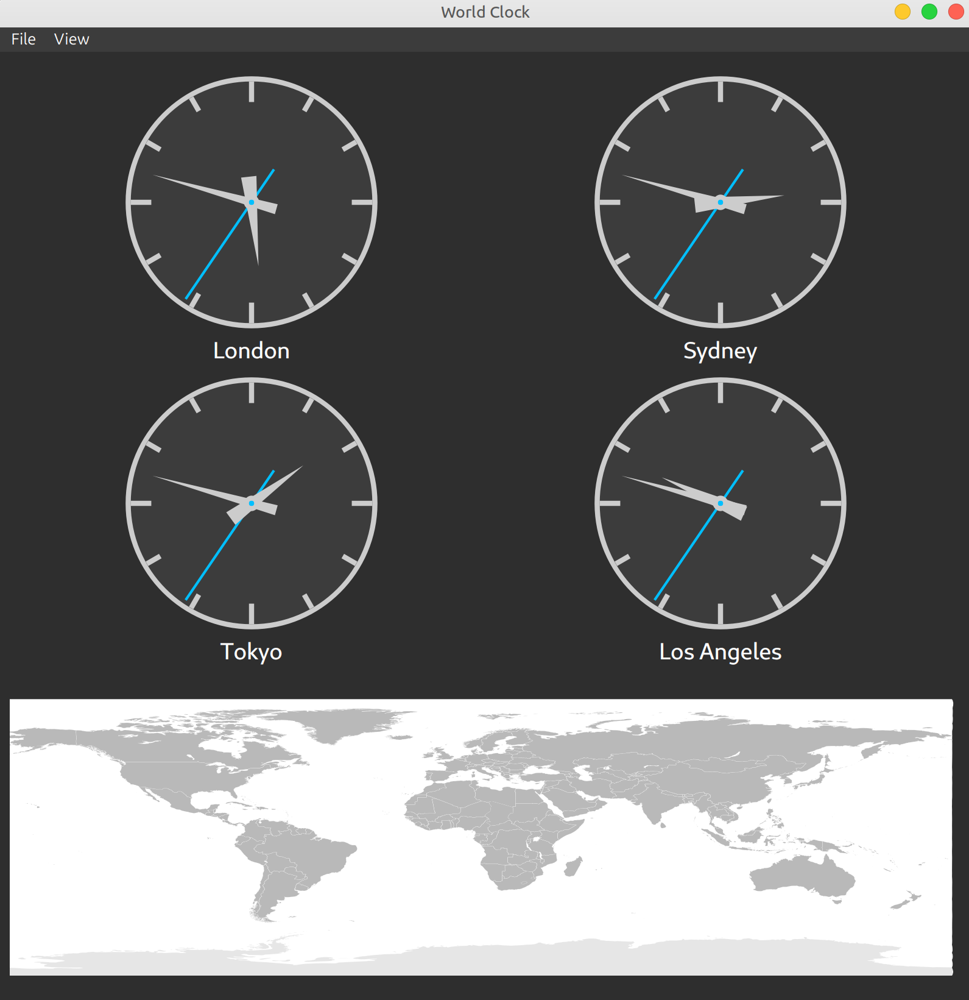

# Python World Clock

A modern and feature-rich world clock application built with Python and PySide6. This application allows you to track the time in multiple cities around the world with a beautiful and intuitive interface.



## Features

*   **Multiple Clocks:** Display up to 8 clocks in a grid.
*   **Dual Clock Modes:** Instantly switch all clocks between stylish Analog and clear Digital formats.
*   **Interactive World Map:** A world map displays pulsing markers for each city, giving you a geographical sense of your selected timezones.
*   **Dynamic Clock Management:**
    *   **Add Clocks:** Easily add new clocks by selecting a timezone from a searchable list.
    *   **Remove Clocks:** Remove clocks you no longer need.
*   **Rich Visual Effects:**
    *   **Smooth Animations:** The analog clocks feature smoothly sweeping second hands.
    *   **Pulsing Map Markers:** The map markers gently pulse to draw your attention.
    *   **Fade In/Out:** Clocks gracefully fade in and out when added or removed.
*   **Cross-Platform:** Built with Qt (via PySide6), it runs on Linux, Windows, and macOS.

## Installation

1.  **Clone the repository:**
    ```bash
    git clone <repository-url>
    cd <repository-directory>
    ```

2.  **Install dependencies:**
    It's recommended to use a virtual environment.
    ```bash
    python -m venv venv
    source venv/bin/activate  # On Windows use `venv\Scripts\activate`
    pip install -r requirements.txt
    ```

## Usage

Run the application with the following command:
```bash
python world_clock.py
```

## How It Works

*   **GUI:** The graphical user interface is built using [PySide6](https://www.qt.io/qt-for-python), the official Python bindings for Qt.
*   **Timezones:** Timezone data is handled by the robust `pytz` library.
*   **Geocoding:** The map markers are placed using latitude and longitude data retrieved with the `geopy` library.
*   **Map:** The world map is an SVG file displayed using `QSvgWidget`.
*   **Animations:** Visual effects are created using `QPropertyAnimation` and custom painting with `QPainter`.
